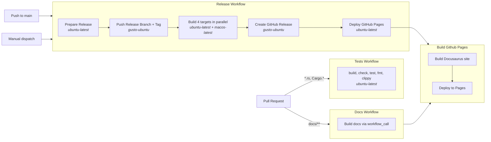

# CI Workflows

## Workflow files

| File | Trigger | What it does |
|---|---|---|
| `test.yml` | PR (Rust/Cargo files) | cargo build, check, test, fmt, clippy |
| `docs.yml` | PR (docs/ files) | Calls `gh-page.yml` to verify docs build |
| `release.yml` | Push to main, manual dispatch | CalVer stamp, cross-compile 4 targets, create GitHub release, deploy Pages |
| `gh-page.yml` | `workflow_call` only | Build Docusaurus site and deploy to GitHub Pages |

## Notes

- **Runner split**: Most jobs use GitHub-hosted runners (`ubuntu-latest`, `macos-latest`). Jobs that need write access (git push, release creation) use `gusto-ubuntu-default` due to the Gusto org IP allow list.
- **Version format**: CalVer `YEAR.MONTH.DAY+HHMM` (e.g., `2026.4.7+1823`). The `+HHMM` build metadata is ignored by Cargo for version comparison but ensures unique tags. See the comment in `release.yml` for details.
- **Pages deployment**: Triggered by the Release workflow via `workflow_call`, not by tag patterns.
