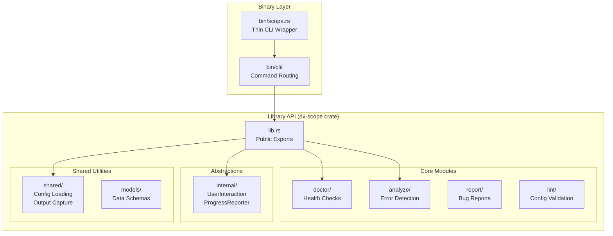
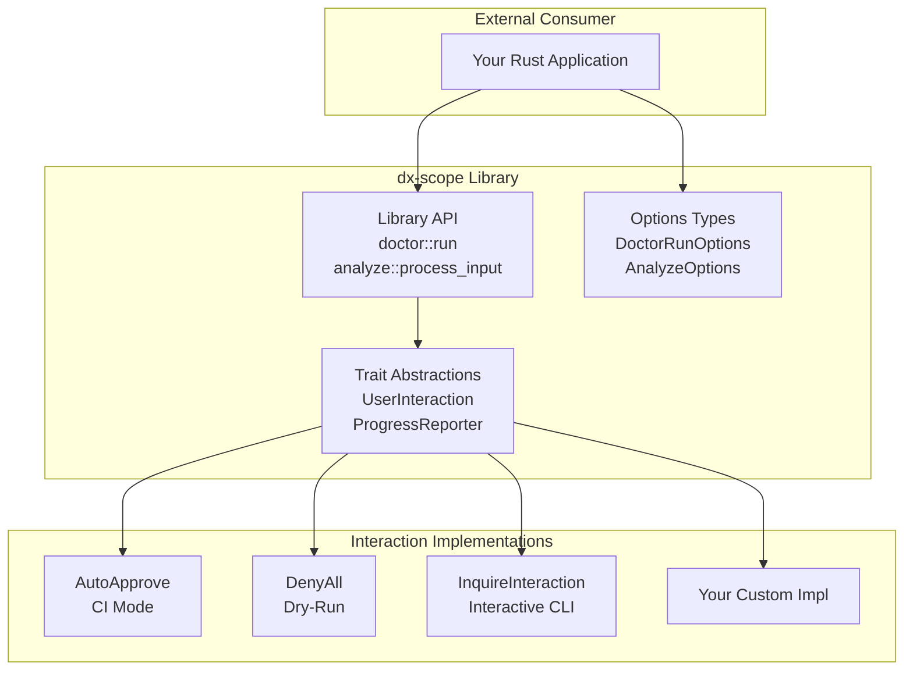
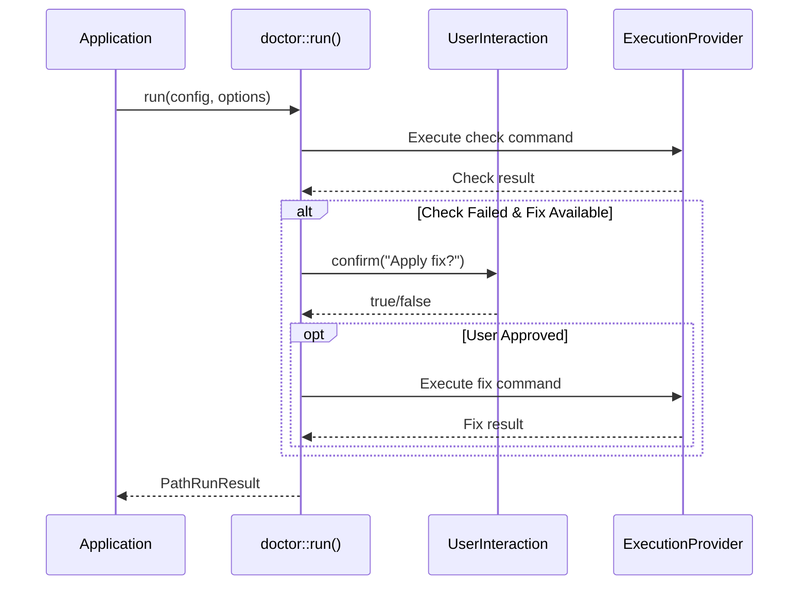

# Architecture

This document describes the architecture of the `dx-scope` library and how it separates library functionality from CLI concerns.

## Module Structure

## Library API Flow

## Data Flow: Doctor Run

## Key Design Principles

### Library-First Design

The codebase follows a library-first approach where:

1. **Core functionality lives in the library** - All health check logic, error detection, and configuration handling is in the `dx-scope` crate
2. **CLI is a thin wrapper** - The binary (`bin/scope.rs`) is approximately 100 lines and delegates to the library
3. **No console output in library code** - The library uses tracing for logging; CLI-specific output functions live in `bin/cli/`

### Trait Abstractions

The library uses traits to abstract user interaction and progress reporting:

| Trait | Purpose | Implementations |
|-------|---------|-----------------|
| `UserInteraction` | Prompt user for confirmations | `AutoApprove`, `DenyAll`, `InquireInteraction` |
| `ProgressReporter` | Report progress updates | `NoOpProgress` |
| `ExecutionProvider` | Execute shell commands | `DefaultExecutionProvider`, `MockExecutionProvider` |

### Options Types

Each major operation has a dedicated options type that is independent of CLI argument parsing:

| Options Type | Module | Purpose |
|--------------|--------|---------|
| `DoctorRunOptions` | `doctor` | Configure health check runs |
| `AnalyzeOptions` | `analyze` | Configure error detection |
| `ConfigLoadOptions` | `shared::config` | Configure configuration loading |

## Module Responsibilities

### `doctor/`

Health check system that:
- Runs checks defined in configuration
- Applies fixes when checks fail (with user confirmation)
- Reports results via `PathRunResult`

Key types:
- `DoctorRunOptions` - Run configuration
- `PathRunResult` - Execution results

### `analyze/`

Error detection system that:
- Scans text/files for known error patterns
- Matches against configured `KnownError` definitions
- Reports matches via `AnalyzeStatus`

Key types:
- `AnalyzeOptions` - Analysis configuration
- `AnalyzeInput` - Input source specification
- `AnalyzeStatus` - Analysis outcome

### `internal/`

Abstraction traits for:
- User interaction (prompts, confirmations)
- Progress reporting

### `shared/`

Shared utilities including:
- Configuration loading
- Command execution
- Output capture
- Report building

### `models/`

Data model definitions including:
- `DoctorGroup` - Health check group definition
- `KnownError` - Error pattern definition
- `ReportLocation` - Report upload configuration

## See Also

- [Library Usage Guide](../library-usage.md) - How to use dx-scope as a library
- [API Documentation](https://docs.rs/dx-scope) - Generated API documentation
